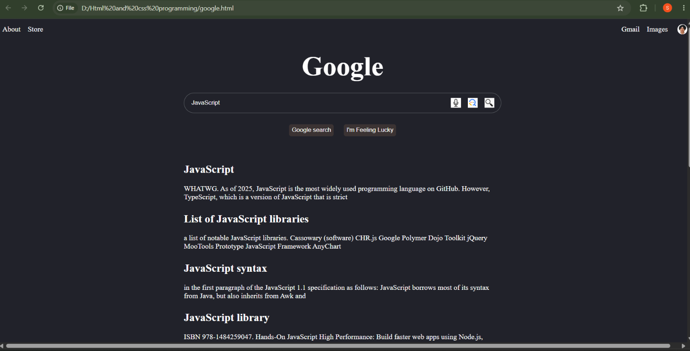

# Google Clone

A front-end recreation of the Google homepage built from scratch using HTML, CSS, and JavaScript.

## Preview



## Features

- Google-inspired homepage layout
- Search bar interface
- Google Search and I'm Feeling Lucky buttons
- Navigation links
- Responsive page layout
- Interactive elements using JavaScript
- Clean and minimal user interface

## Technologies

- **HTML5** – Page structure and content
- **CSS3** – Styling, layout, and responsive design
- **JavaScript** – Interactive functionality

## Project Structure

```text
Google-Clone/
│
├── google.html
├── style.css
├── script.js
├── google-replica.png
├── google-replica-updated-version.png
└── README.md
```

## How to Run
-Download or clone this repository.
-Open google.html in a web browser.
-The Google Clone will run locally.

## What I Learned

Through this project, I practiced:

-Structuring webpages using HTML
-Creating layouts and styling interfaces with CSS
-Using JavaScript to add interactivity
-Building a clean and simple user interface
-Organizing files in a web development project
-Using Git and GitHub for version control

## Future Improvements

-Connect the search bar to a real search API
-Improve responsiveness across different screen sizes
-Add more interactive functionality
-Improve accessibility and keyboard navigation
-Add additional animations and UI interactions

##Disclaimer 

This project is a student-built recreation of the Google homepage for educational purposes. It is not affiliated with or endorsed by Google.
